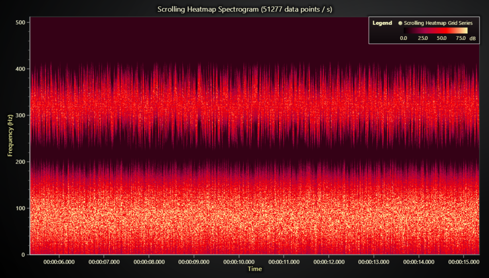

# JavaScript Scrolling Heatmap Chart



This demo application belongs to the set of examples for LightningChart JS, data visualization library for JavaScript.

LightningChart JS is entirely GPU accelerated and performance optimized charting library for presenting massive amounts of data. It offers an easy way of creating sophisticated and interactive charts and adding them to your website or web application.

The demo can be used as an example or a seed project. Local execution requires the following steps:

-   Make sure that relevant version of [Node.js](https://nodejs.org/en/download/) is installed
-   Open the project folder in a terminal:

          npm install              # fetches dependencies
          npm start                # builds an application and starts the development server

-   The application is available at _http://localhost:8080_ in your browser, webpack-dev-server provides hot reload functionality.


## Description

This example showcases simple usage of `HeatmapScrollingGridSeries`, a simple, yet incredibly powerful series type.

`HeatmapScrollingGridSeries` visualizes three dimensional data (X, Y, color) of large quantities.
It can easily handle data sets in million data points range even on low-end devices.
With large amounts of RAM even **billions** of data points can be visualized!

Heatmaps can be created in XY Charts:

```javascript
// Add heatmap scrolling Grid Series to a XY Chart
chartXY.addHeatmapScrollingGridSeries({
    resolution: 100,
})
```

The example displays live speed of incoming data as _data points per second_, feel free to try higher data rates by altering `dataSampleSize` in the example code to see how much data `HeatmapScrollingGridSeries` can handle on your machine!

For reference, on a Lenovo Yoga (average office laptop with no GPU to speak of), there was no visible effort even with `dataSampleSize: 5000` which means **150 000 incoming data points every single second**.

What's equally impressive is that thanks to automatic data cleaning, this application can _run indefinitely!_ Read more about automatic data cleaning with `HeatmapScrollingGridSeries` below.

# Heatmap Scrolling Grid Series options

When `HeatmapScrollingGridSeries` is created, there is only one property that has to be specified always:

`resolution`: amount of data values along non-scrolling dimension.

With just this configuration, a fully functional scrolling heatmap grid series capable of handling tens of millions data points is created.

The following optional properties can be used for tweaking heatmap behavior for exact application purposes:

`start`: Axis coordinate where heatmap grid begins.

`step`: The Axis offset between two heatmap cells.

`scrollDimension`: By default the series is configured to have fixed `rows` (Y) resolution and scroll indefinitely along `columns` (X). This can be flipped by specifying `scrollDimension: rows`.

# Heatmap Scrolling Grid Series data input

`HeatmapScrollingGridSeries` receives data as _append_ operation to push on top of previously pushed data.

Data is added using `addIntensityValues` method:

```js
// Example syntax, append 2 samples to scrolling heatmap grid with resolution: 10
heatmap.addIntensityValues([
    [0, 1, 2, 3, 4, 5, 6, 7, 8, 9],
    [0, 1, 2, 3, 4, 5, 6, 7, 8, 9],
])
```

# Heatmap Scrolling Grid Series data cleaning

Automatic data cleaning is essential in streaming applications that run for long times or _even indefinitely_;

In LightningChart JS, this is configured with the `setDataCleaning` method;

```js
// Example, configure automatic data cleaning.
heatmapGridSeries.setDataCleaning({
    // Out of view data can be lazily removed as long as total scrolling columns count remains over 1000.
    minDataPointCount: 1000,
})
```

Simple? _- Yes._

Powerful? _- Naturally._


## API Links

* [Scrolling Heatmap Grid Series]
* [Paletted Fill Style]
* [Color lookup table]
* [Color factory HSV]
* [Empty line style]
* [Axis automatic scroll options]
* [Chart XY]
* [Axis XY]
* [Legend Box]


## Support

If you notice an error in the example code, please open an issue on [GitHub][0] repository of the entire example.

Official [API documentation][1] can be found on [LightningChart][2] website.

If the docs and other materials do not solve your problem as well as implementation help is needed, ask on [StackOverflow][3] (tagged lightningchart).

If you think you found a bug in the LightningChart JavaScript library, please contact support@lightningchart.com.

Direct developer email support can be purchased through a [Support Plan][4] or by contacting sales@lightningchart.com.

[0]: https://github.com/Arction/
[1]: https://lightningchart.com/lightningchart-js-api-documentation/
[2]: https://lightningchart.com
[3]: https://stackoverflow.com/questions/tagged/lightningchart
[4]: https://lightningchart.com/support-services/

© LightningChart Ltd 2009-2022. All rights reserved.


[Scrolling Heatmap Grid Series]: https://lightningchart.com/js-charts/api-documentation/v4.2.0/classes/HeatmapScrollingGridSeriesIntensityValues.html
[Paletted Fill Style]: https://lightningchart.com/js-charts/api-documentation/v4.2.0/classes/PalettedFill.html
[Color lookup table]: https://lightningchart.com/js-charts/api-documentation/v4.2.0/classes/LUT.html
[Color factory HSV]: https://lightningchart.com/js-charts/api-documentation/v4.2.0/functions/ColorHSV.html
[Empty line style]: https://lightningchart.com/js-charts/api-documentation/v4.2.0/variables/emptyLine.html
[Axis automatic scroll options]: https://lightningchart.com/js-charts/api-documentation/v4.2.0/variables/AxisScrollStrategies.html
[Chart XY]: https://lightningchart.com/js-charts/api-documentation/v4.2.0/classes/ChartXY.html
[Axis XY]: https://lightningchart.com/js-charts/api-documentation/v4.2.0/classes/Axis.html
[Legend Box]: https://lightningchart.com/js-charts/api-documentation/v4.2.0/classes/Chart.html#addLegendBox

